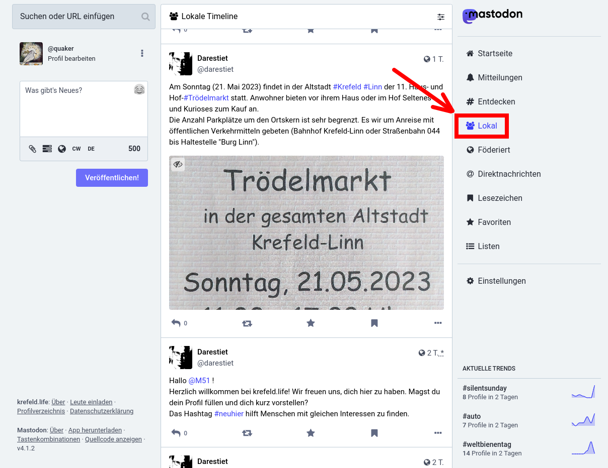
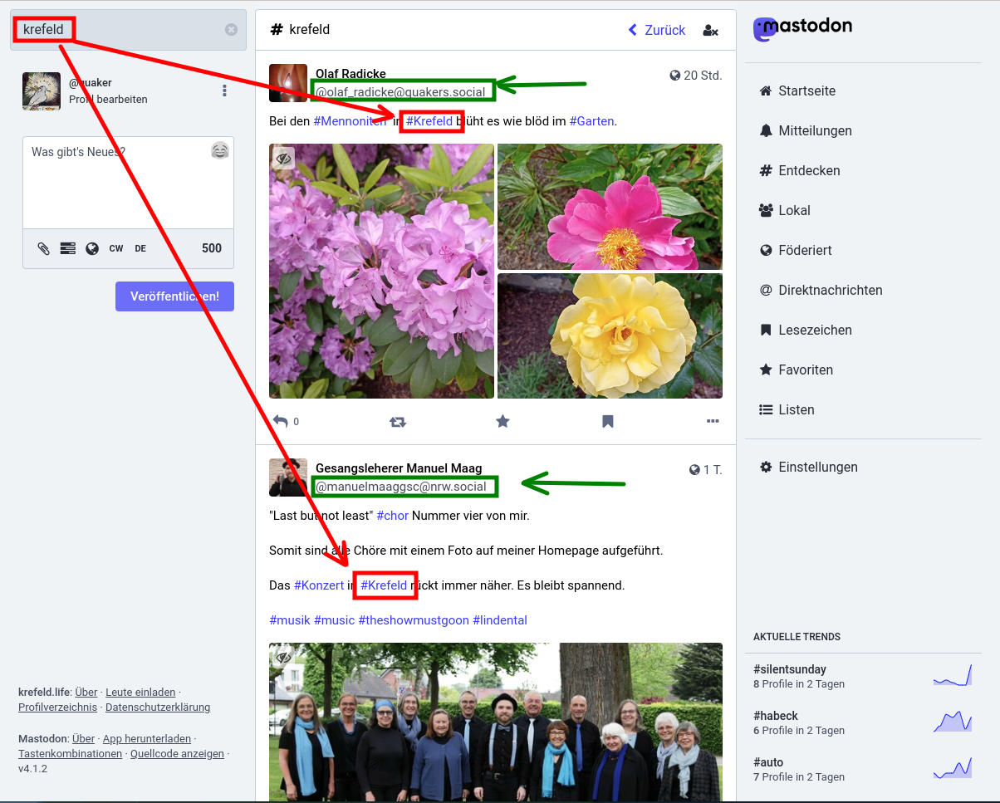

Erste schritte für Quartierbewohner.Innen
-----------------------------------------

### Was brauche ich, um Mastodon zu benutzen?

#### Website/Browser

Du kannst Mastodon direkt in deinem Browser benutzen. Ohne Einschränkungen.

#### Handy-App(s)

Da Mastodon nicht einer einzelnen Firma gehört, steht es jedem frei, eine eigene App zu programmieren. Deshalb hast du die Qual der Wahl. Hier einige Apps die du dir mal ansehen kannst:

| Name      | Sterne | Downloads | Link |
|-----------|--------|-----------|------|
| Mastodon  | 3,3    | 1 Mio+    | [play.google.com](https://play.google.com/store/apps/details?id=org.joinmastodon.android)    |
| Tusky     | 4,2    | 100.000+  | [play.google.com](https://play.google.com/store/apps/details?id=com.keylesspalace.tusky)     |
| Fedilab   | 4,6    | 10.000+   | [play.google.com](https://play.google.com/store/apps/details?id=app.fedilab.android)         |
| Megalodon | 4,5    | 5.000+    | [play.google.com](https://play.google.com/store/apps/details?id=org.joinmastodon.android.sk) |
| Moshidon  | 4,3    | 500+      | [play.google.com](https://play.google.com/store/apps/details?id=org.joinmastodon.android.moshinda) |

### Wie baue ich mein eigenes Netzwerk auf?

Wenn du frisch angemeldet bist, wird es in deiner “Timeline” noch recht langweilig aussehen. Erst wenn du Accounts folgst, deren Inhalte dich interessieren, wird sich deine Timeline mit interessanten Benachrichtigungen füllen. Die Frage lautet also: Wie finde ich interessante Accounts?

#### Lokale Timeline

Wenn du einen Server ausgewählt hast, der einen Themenschwerpunkt hat, z.B. https://krefeld.life/, kannst du in die lokale Timeline schauen. Hier findest du nur die Beiträge der Accounts dieser Instanz. Also höchstwahrscheinlich wahrscheinlich Beiträge von Accounts, denen der lokale Bezug zu Krefeld wichtig ist. Folge den Accounts, deren Beiträge du interessant findest.

| |
|----------------------------------------------|
| Ansicht im Browser                           |

#### Server mit einem Bezug zu Krefeld

Wenn du in lokalen Timelines nach interessanten Accounts durchsuchen willst, sind hier noch einige Server mit Bezug zu Krefeld

| URL                                  | Kommentar |
|--------------------------------------|-----------|
| https://krefeld.life/directory       | Server mit direktem Bezug zu Krefeld |
| https://nrw.social/directory         | Da Krefeld in NRW liegt, wirst du auch einige Accounts auf diesem Server finden |
| https://feedbeat.me/about            | Hier geht es vorallem um Kultur, aber die Macher stammen aus Krefeld |
| https://ruhrpott.social/public/local | Gut, Krefeld ist nicht Ruhrgebiet, aber nahe bei. |
| https://ruhr.social/public/local     | Noch mal Ruhrgebiet |

#### Nach Hashtags suchen

Da jeder die freie Wahl hat, wird es auch Accounts geben, die sich mit deinem Quartier beschäftigen, ohne einen Account auf einem Server mit einem Bezug zu deinem lokalen Quartier (Krefeld). Um diese Accounts zu finden, gibt es eine Suchfunktion. Wenn die Autoren Hashtags in ihren Nachrichten verwenden, kannst du sie darüber finden. Umgekehrt gilt dasselbe: Verwende Hashtags, mit deine Beiträge von deiner Zielgruppe gefunden werden!

| |
|----------------------------------------------|
| Ansicht im Browser                           |

#### Accounts mit lokalen Bezug zu Krefeld

Hier ein paar accounts als Vorschlag zum Einstieg:

| Thema                                     | Account                              |
|-------------------------------------------|--------------------------------------|
| Buchladen in Linn                         | eva@krefeld.life                     |
| (Katastrophen) Warnmeldungen für Krefeld. | FediNINA_Krefeld@social.prepedia.org |
| Gospelmusik in Krefeld                    | GospelMusik@krefeld.life             |
| Der Jazzkeller Krefeld                    | Jazzkeller@feedbeat.me               |
| Online-Zeitung für Rhein-Ruhr             | LokalKlick@nrw.social                |
| Folklorefest Krefeld                      | Folklorefest@krefeld.life            |
| Fest ohne Grenzen                         | FestOhneGrenzen@krefeld.life         |
| Die Grünen Krefeld                        | jtkrefelder@gruene.social            |
| Künstlerin                                | Pe@feedbeat.me                       |
| ev. Kirche im Ruhrgebiet                  | ruhrPott@kirche.social               |
| Quäker-Andacht in Krefeld                 | quaker@krefeld.life                  |
| Lokaler Blogger                           | darestiet@krefeld.life               |
| Lokaler Blogger                           | KRDigital@ruhr.social                |
| Lokaler Blogger                           | martin_kramer@krefeld.life           |

#### Virtuelle Gruppen

Es ist nicht vorgesehen, in Mastodon Gruppen zu bilden. Es gibt Drittanbieter wie z.B. a.gup.pe die das mit Workaround kompensieren wollen. So gibt es z.B die Gruppe krefeld@a.gup.pe. Wenn du den Account in deinem Beitrag erwähnst, bekommen alle, die diesem Account folgen, deine Nachricht. Diese Option ist aber nicht sehr verbreitet.

#### Sich vorstellen

Es ist eine gute Idee und Geste, sich auf dem Server vorzustellen, auf dem man seinen Account angelegt hat. Benutze den Hashtag “#neuhier” und “#krefeld” . Moderatoren und Admins auf deinem Server werden höchstwahrscheinlich deinen Post booten, also an ihre Follower weiterleiten. Es liegt an dir, einen Vorstellungstext zu schreiben, der anderen Lust macht, dir zu folgen!

[zurück zum Index](markdown/00-00-index.md)